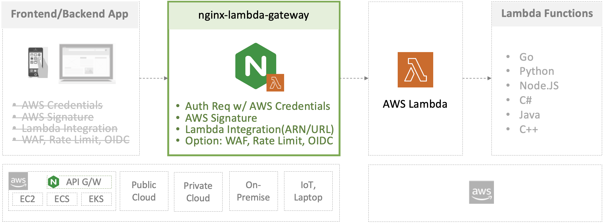

# NGINX Lambda Gateway

## Introduction

This project provides a working configuration of NGINX configured to act as an authenticating gateway for the AWS Lambda service. This allows you to proxy a private Lambda function without requiring users to authenticate to it via AWS signature. 



Within the proxy layer of `nginx-lambda-gateway`, additional functionality can be configured such as:

- Providing an AWS signature based authentication gateway using an alternative authentication
   system to AWS Lambda functions
- For internal/micro services that can't authenticate against the AWS Lambda functions
   (e.g. don't have libraries available) the gateway can provide a means
   to accessing Lambda functions without authentication
- Protecting Lambda functions from arbitrary public access and traversal
- For internal/micro services that can't authenticate against the AWS Lambda functions
- [Rate limiting](http://nginx.org/en/docs/http/ngx_http_limit_req_module.html) AWS Lambda functions
- Authenticating users to authorize AWS Lambda functions with a [OIDC](https://github.com/nginx-openid-connect)
- Protecting AWS Lambda functions with a [WAF](https://docs.nginx.com/nginx-waf/)


## Getting Started

Refer to the [Getting Started Guide](docs/getting_started.md) for how to build and run the gateway.

## Directory Structure and File Descriptions

```
nginx-lambda-gateway
│
├── common
│   ├── etc
│   │   ├── nginx                   default nginx-lambda-gateway configuration
│   │   └── ssl                     contains certificates and NGINX Plus license
│   ├── lambda-core
│   │   ├── awscredentials.js       common lib to read and write AWS credentials
│   │   ├── awssig2.js              common lib to build AWS signature v2
│   │   ├── awssig4.js              common lib to build AWS signature v4
│   │   ├── lambdagateway.js        common lib to integrate the Lambda from NGINX
│   │   ├── lambda_ngx_apis.conf    API endpoints config for nginx-lambda-gateway
│   │   ├── lambda_ngx_http.conf    common config under NGINX http directive
│   │   ├── lambda_ngx_proxy.conf   common config to be set before proxy_pass
│   │   └── utils.js                common lib to be reused by all NJS codebase
│   └── lambda-emulator             proxy for Lambda Runtime API to locally test
│
├── docker
│   ├── Dockerfile.oss              for NGINX OSS  to act as a Lambda gateway
│   └── Dockerfile.plus             for NGINX Plus to act as a Lambda gateway
│
├── docker-compose.yml              Docker config to build and run nginx-lambda-gateway
├── settings.env                    Docker env file
│
├── docs                            contains documentation about the project
│
├── examples
│   ├── 01-all-lambda-function-arns NGINX proxy to all Lambda function ARNs
│   ├── 02-one-lambda-function-arn  NGINX proxy to one Lambda function ARN
│   ├── 03-one-lambda-function-url  NGINX proxy to one Lambda function URL
│   └── 04-lambda-function-arn-url  NGINX proxy to both of Lambda function ARN and URL
│
├── tests                           test launcher and unit/integration test codebase
│
└── Makefile                        automate to build/start/stop nginx-lambda-gateway
```

## Development

Refer to the [Development Guide](docs/development.md) for more information about extending or testing the gateway.

## License

All code include is licensed under the [Apache 2.0 license](LICENSE.txt).

## Inspired Projects
- [NGINX S3 Gateway](https://github.com/nginxinc/nginx-s3-gateway)
- [NGINX AWS Signature](https://github.com/nginxinc/nginx-aws-signature)
- [NGINX Plus OIDC Reference Implementation](https://github.com/nginxinc/nginx-openid-connect)
- [NGINX OIDC Core and App Examples for ACM/NMS/NIC/N+](https://github.com/nginx-openid-connect)
