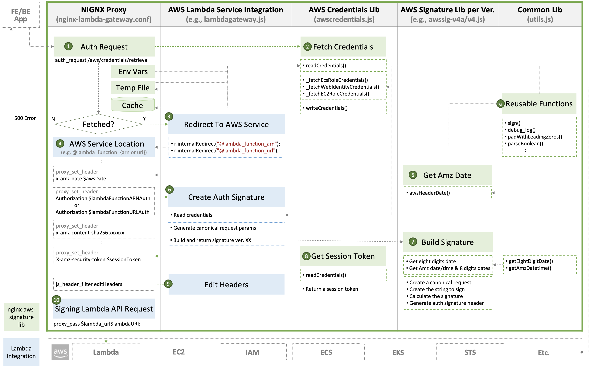

# Development Guide

- [Integrating with AWS Signature](#integrating-with-aws-signature)
- [Enhancing the Gateway](#enhancing-the-gateway)
  - [Enhancing gateway configuration](#enhancing-gateway-configuration)
  - [Examples](#examples)

## Integrating with AWS Signature

Update the following files when enhancing `nginx-lambda-gateway` to integrate with AWS signature whenever AWS releases a new version of signature or you have a new PR:

- NGINX Proxy: [`/etc/nginx/conf.d/nginx_lambda_gateway.conf`](../common/etc/nginx/conf.d/nginx_lambda_gateway.conf)
- AWS Credentials Lib: [`/etc/nginx/serverless/awscredentials.js`](../common/lambda-core/awscredentials.js)
- AWS Signature Lib per version:
  - [`/etc/nginx/include/awssig4.js`](../common/lambda-core/awssig4.js)
- AWS Lambda Integration Lib: [`/etc/nginx/serverless/lambdagateway.js`](../common/lambda-core/lambdagateway.js)
- Common reusable Lib for all of NJS codebases: [`/etc/nginx/serverless/utils.js`](../common/lambda-core/utils.js)

## Enhancing the Gateway

### Enhancing gateway configuration

All files with the extension `.conf` in the directory of `/etc/nginx/conf.d` and `/etc/nginx/serverless` will be loaded into the configuration of the base `http` block within the `/etc/nginx/nginx.conf` of main NGINX configuration.

To enhance the feature of `nginx-lambda-gateway`, additional configuration or enhancements can be altered in the following files before either building the container image or Systemd service:

- NGINX Lambda Gateway main: [`/etc/nginx/conf.d/nginx_lambda_gateway.conf`](../common/etc/nginx/conf.d/nginx_lambda_gateway.conf)
- NGINX API gateway endpoints' configuration for Lambda integration: [`/etc/nginx/serverless/lambda_ngx_apis.conf`](../common/lambda-core/lambda_ngx_apis.conf)
- NGINX configuration of importing NJS codebases and map directives for Lambda integration: [`/etc/nginx/serverless/lambda_ngx_http.conf`](../common/lambda-core/lambda_ngx_http.conf)
- NGINX proxy configuration to be set before proxy_pass to invoke Lambda APIs: [`/etc/nginx/serverless/lambda_ngx_proxy.conf`](../common/lambda-core/lambda_ngx_proxy.conf)

### Examples
