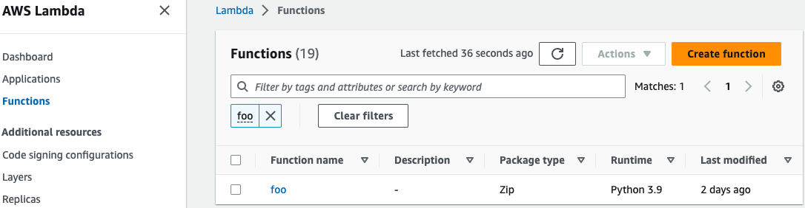

# Getting Started Guide

**TABLE OF CONTENTS:**
- [Prerequisites](#prerequisites)
- [Quick Starter with Running in Your Laptop](#quick-starter-with-running-in-your-laptop)
- [Running as a Systemd Service](#running-as-a-systemd-service)
- [Running in Containers](#running-in-containers)
- [Running Using AWS Instance Profile Credentials](#running-using-aws-instance-profile-credentials)
- [Troubleshooting](#troubleshooting)

## Prerequisites
- Create a AWS Lambda Function
  
  

- Implement and devploy a [AWS Lambda Function](../examples/01-all-lambda-function-arns/lambda_functions/foo.py)

  

- [**Optional:** Download NGINX Plus license files](https://www.nginx.com/free-trial-request/), and copy them to [`./common/etc/ssl/`](../common/etc/ssl/)

  ```
  nginx-repo.crt
  nginx-repo.key
  ```
  > Note: This step is only required when running `nginx-lambda-gateway` using NGINX Plus.

- Configure environment variables in [`settings.env`](../settings.env)

  | Name                       | Required? | Allowed Values  | Default                              | Description                                   |
  |----------------------------|-----------|-----------------|--------------------------------------|-----------------------------------------------|
  | `LAMBDA_REGION`            | Yes       |                 | `${AWS_REGION}`                      | Lambda region whose servers you want to send the requests |
  | `LAMBDA_SERVER_PROTO`      | Yes       | `http`, `https` | `https`                              | Protocol to used connect to Lambda server     |
  | `LAMBDA_SERVER`            | Yes       |                 | `lambda.${AWS_REGION}.amazonaws.com` | Lambda host to connect to                     |
  | `LAMBDA_SERVER_PORT`       | Yes       |                 | `443`                                | SSL/TLS port to connect to                    |
  | `AWS_ACCESS_KEY_ID`        | No        |                 | `${AWS_ACCESS_KEY_ID}`               | AWS access key associated with an IAM account |
  | `AWS_SECRET_ACCESS_KEY`    | No        |                 | `${AWS_SECRET_ACCESS_KEY}`           | AWS secret key associated with the access key |
  | `AWS_SESSION_TOKEN`        | No        |                 | `${AWS_SESSION_TOKEN}`               | AWS session token value that is required if you are using temporary security credentials |
  | `DEBUG`                    | No        | `true`, `false` | `false`                              | Flag enabling AWS signatures debug output     |
  | `HEADER_PREFIXES_TO_STRIP` | No        | `true`, `false` | `false`                              | A list of HTTP header prefixes that exclude headers client responses. List should be specified in lower-case and a semicolon (;) should be used to as a deliminator between values. For example: `x-amz-;x-something-` |

  > Note: 
  > - Define the following environment variables in your machine when using the above default values.
  >   e.g.: `AWS_REGION`, `AWS_ACCESS_KEY_ID`, `AWS_SECRET_ACCESS_KEY`, `AWS_SESSION_TOKEN` in `~/.bash_profile`.
  > - `AWS_ACCESS_KEY_ID`, `AWS_SECRET_ACCESS_KEY`, `AWS_SESSION_TOKEN` are only used to configure the gateway when running as a Container or as a Systemd service.
 
- **Optional:** Edit nginx configuration

  Skip this step when using 80 port and one AWS region for multiple AWS Lambda Function ARNs. Otherwise, configure the [`/etc/nginx/conf.d/nginx_lambda_gateway.conf`](../common/etc/nginx/conf.d/nginx_lambda_gateway.conf):

  ```nginx
  map $request_uri $lambda_host {
    # Use default host ($lambdaFunctionARNHost) when using one region for
    # multiple Lambda Function ARNs per NGINX Lambda Gateway.
    default $lambdaFunctionARNHost;

    # Add default host per endpoint when using multiple regions for
    # multiple Lambda Function ARNs per NGINX Lambda Gateway.
    # '/2015-03-31/functions/foo/invocations' $lambdaFunctionARNHost;

    # Add the following host with ediging {url_id} and {aws-region} per endpoint
    # when using AWS Lambda Function URL
    # '/bar' {url-id}.lambda-url.{aws-region}.on.aws;
  }

  map $request_uri $lambda_url {
    # Use default Lambda server URL when using AWS Lambda Function ARN.
    default  $lambdaProto://$lambda_host:$lambdaPort;

    # Add Lambda server URL per endpoint when using AWS Lambda Function URL.
    # '/bar' $lambdaProto://$lambda_host/;
  }

  server {
    include "serverless/lambda_ngx_apis.conf";
    listen 80; # Use SSL/TLS in production

    # Use this config when using a proxy to all AWS Lambda Function ARNs.
    location / {
        auth_request /aws/credentials/retrieval;
        js_content lambdagateway.redirectToLambdaFunctionARN;
    }

    # Add this config per endpoint when using a proxy to a Lambda Function ARN.
    # - arn:aws:lambda:{aws-region}:{account-id}:function:foo
    # location /2015-03-31/functions/foo/invocations {
    #     auth_request /aws/credentials/retrieval;
    #     js_content lambdagateway.redirectToLambdaFunctionARN;
    # }

    # Add this config per endpoint when using a proxy to a Lambda Function URL.
    # - https://{url-id}.lambda-url.{aws-region}.on.aws/
    # location /bar {
    #     auth_request /aws/credentials/retrieval;
    #     js_content lambdagateway.redirectToLambdaFunctionURL;
    # }

    # Enable when debugging is needed
    # error_log  /var/log/nginx/error.log  debug; # Reduce severity level as required
    # access_log /var/log/nginx/access.log main;
  }
  ```

## Quick Starter with Running in Your Laptop
- [Install and run Docker](https://docs.docker.com/engine/install/)
- Start a NGINX Lambda Gateway
- Stop a NGINX Lambda Gateway
- Clean a NGINX Lambda Gateway Container Image

## Running as a Systemd Service
- TBD

## Running in Containers
- TBD

## Running Using AWS Instance Profile Credentials
- TBD

## Troubleshooting
- TBD
