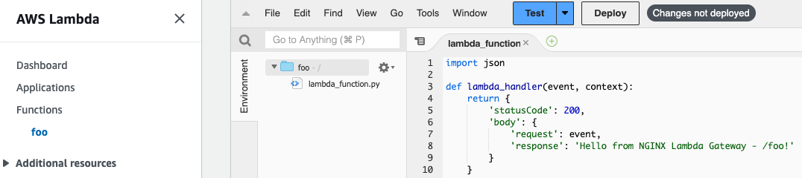

# Getting Started Guide

**TABLE OF CONTENTS:**
- [Prerequisites](#prerequisites)
- [Quick Starter with Running in Your Laptop](#quick-starter-with-running-in-your-laptop)
- [Running as a Systemd Service](#running-as-a-systemd-service)
- [Running in Containers](#running-in-containers)
- [Running Using AWS Instance Profile Credentials](#running-using-aws-instance-profile-credentials)
- [Troubleshooting](#troubleshooting)

## Prerequisites
- Create a AWS Lambda Function
  
  

- Implement and devploy a [AWS Lambda Function](../examples/01-all-lambda-function-arns/lambda_functions/foo.py)

  

- [Download NGINX Plus license files](https://www.nginx.com/free-trial-request/), and copy them to [`./common/etc/ssl/`](../common/etc/ssl/)

  ```
  nginx-repo.crt
  nginx-repo.key
  ```

- Configure environment variables in [`settings.env`](../settings.env)

  | Name                       | Required? | Allowed Values  | Default                              | Description                                   |
  |----------------------------|-----------|-----------------|--------------------------------------|-----------------------------------------------|
  | `LAMBDA_REGION`            | Yes       |                 | `${AWS_REGION}`                      | Lambda region whose servers you want to send the requests |
  | `LAMBDA_SERVER_PROTO`      | Yes       | `http`, `https` | `https`                              | Protocol to used connect to Lambda server     |
  | `LAMBDA_SERVER`            | Yes       |                 | `lambda.${AWS_REGION}.amazonaws.com` | Lambda host to connect to                     |
  | `LAMBDA_SERVER_PORT`       | Yes       |                 | `443`                                | SSL/TLS port to connect to                    |
  | `AWS_ACCESS_KEY_ID`        | No        |                 | `${AWS_ACCESS_KEY_ID}`               | AWS access key associated with an IAM account |
  | `AWS_SECRET_ACCESS_KEY`    | No        |                 | `${AWS_SECRET_ACCESS_KEY}`           | AWS secret key associated with the access key |
  | `AWS_SESSION_TOKEN`        | No        |                 | `${AWS_SESSION_TOKEN}`               | AWS session token value that is required if you are using temporary security credentials |
  | `DEBUG`                    | No        | `true`, `false` | `false`                              | Flag enabling AWS signatures debug output     |
  | `HEADER_PREFIXES_TO_STRIP` | No        | `true`, `false` | `false`                              | A list of HTTP header prefixes that exclude headers client responses. List should be specified in lower-case and a semicolon (;) should be used to as a deliminator between values. For example: `x-amz-;x-something-` |

  > Note: 
  > - Define the following environment variables in your machine if you want to use the above default values.
  >   e.g.: `AWS_REGION`, `AWS_ACCESS_KEY_ID`, `AWS_SECRET_ACCESS_KEY`, `AWS_SESSION_TOKEN` in `~/.bash_profile`.
  > - `AWS_ACCESS_KEY_ID`, `AWS_SECRET_ACCESS_KEY`, `AWS_SESSION_TOKEN` are only used to configure the gateway when running as a Container or as a Systemd service.
 

- Edit nginx configuration

## Quick Starter with Running in Your Laptop
- [Install and run Docker](https://docs.docker.com/engine/install/)
- Start a NGINX Lambda Gateway
- Stop a NGINX Lambda Gateway
- Clean a NGINX Lambda Gateway Container Image

## Running as a Systemd Service
- TBD

## Running in Containers
- TBD

## Running Using AWS Instance Profile Credentials
- TBD

## Troubleshooting
- TBD
