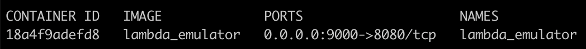

# AWS Lambda Runtime Interface Emulator

The AWS Lambda Runtime Interface Emulator (RIE) is a proxy for the Lambda Runtime API that allows you to locally test your Lambda function packaged as a container image. The emulator is a lightweight web server that converts HTTP requests into JSON events to pass to the Lambda function in the container image.

> Note: The RIE does not emulate **Lambda’s security and authentication configurations**, or Lambda orchestration.


## Getting Started

- **Implement a Lambda Function:**
  
  e.g., [`app/lambda_function.py`](./app/lambda_function.py):

  ```python
    import json

    def lambda_handler(event, context):
        return {
            'statusCode': 200,
            'body': {
                'request': event,
                'response': 'Hello from NGINX Lambda Gateway Emulator!'
            }
        }
  ```

- **Start a Lambda Emulator:**
  ```bash
  make start
  ```

- **Check if Lambda Emulator is started:**
  ```bash
  make watch
  ```
  

- **Test a function via Lambda Emulator:**
  ```bash
  curl -XPOST "http://localhost:9000/2015-03-31/functions/function/invocations" -d '{"message": "This is to test a Lambda Function ARN."}'

  curl -XPOST "http://localhost:9000/2015-03-31/functions/function/invocations" -d '{}'
  ```

- **Stop a Lambda Emulator:**
  ```bash
  make down
  ```

- **Clean Lambda Emulator Container Image:**
  ```bash
  make clean
  ```

## References
- [Testing Lambda container images locally](https://docs.aws.amazon.com/lambda/latest/dg/images-test.html)
- [Using AWS Lambda environment variables](https://docs.aws.amazon.com/lambda/latest/dg/configuration-envvars.html)
